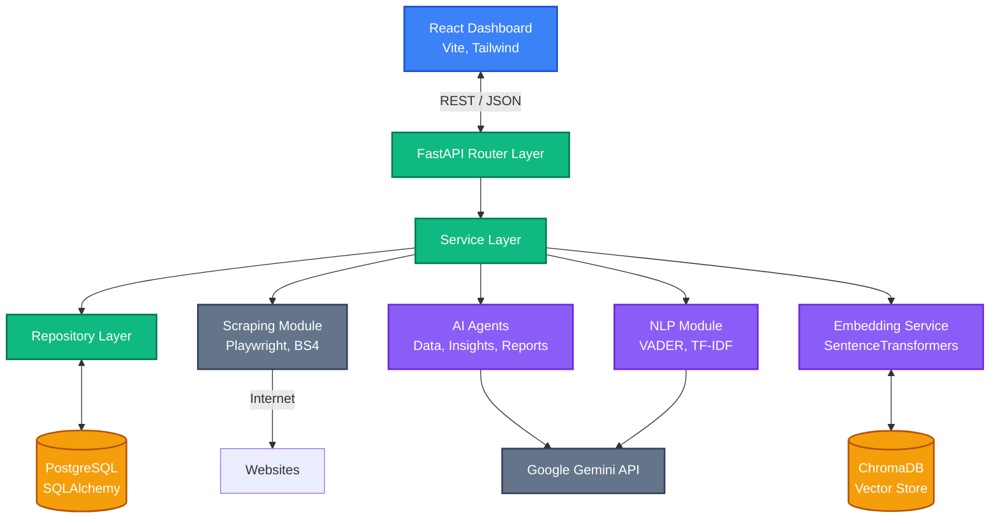

# System Architecture

The AI Market Intelligence Platform follows a classic multi-tier architecture, augmented with an AI Intelligence Layer.

## High-Level Architecture

## Application Layers

1. **API Layer (`app/api/routes`)**: Defines REST endpoints, validates incoming JSON using Pydantic, and returns formatted responses.
2. **Service Layer (`app/services`)**: Orchestrates business logic. It combines multiple repositories or external tools (like AI or Scraping) to fulfill a request.
3. **Repository Layer (`app/repositories`)**: Abstracts database interactions. Extends a generic CRUD base class with model-specific SQL queries.
4. **AI Intelligence Layer (`app/nlp`, `app/embeddings`, `app/agents`)**: Handles text preprocessing, semantic embeddings, sentiment analysis, and interaction with the Google Gemini LLM.
