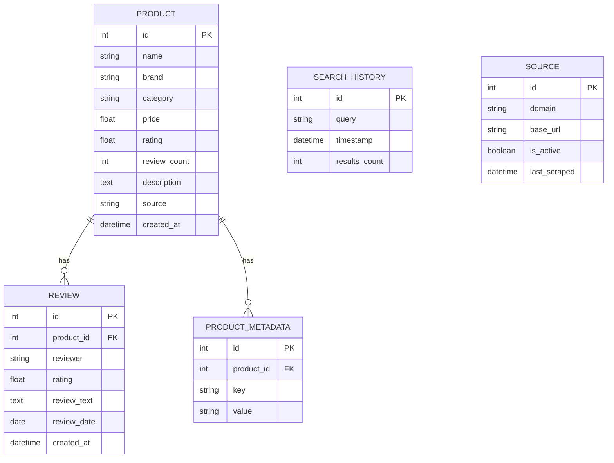

# Database Schema

The platform uses **PostgreSQL** as the primary relational database, managed via **SQLAlchemy 2.0 ORM**.

## Entity Relationship Diagram (ERD)

## Vector Database

In addition to PostgreSQL, the platform uses **ChromaDB** (an embedded vector database stored in the `chroma_db/` directory).

- **Collection**: `market_intel_collection`
- **Embeddings**: Generated using `sentence-transformers/all-MiniLM-L6-v2` (384 dimensions).
- **Metadata Stored**:
  - `type`: Either `product` or `review`
  - `id`: The PostgreSQL primary key corresponding to the record
  - `brand`, `category`: Stored for filtering
